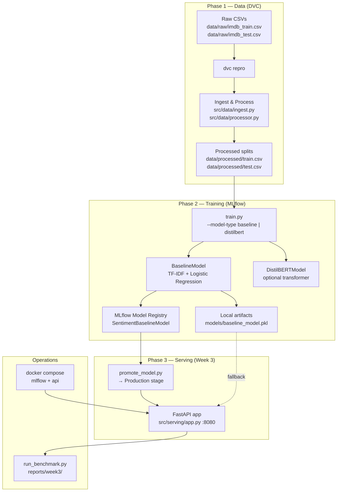
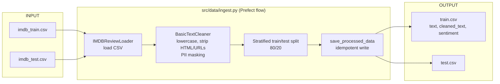
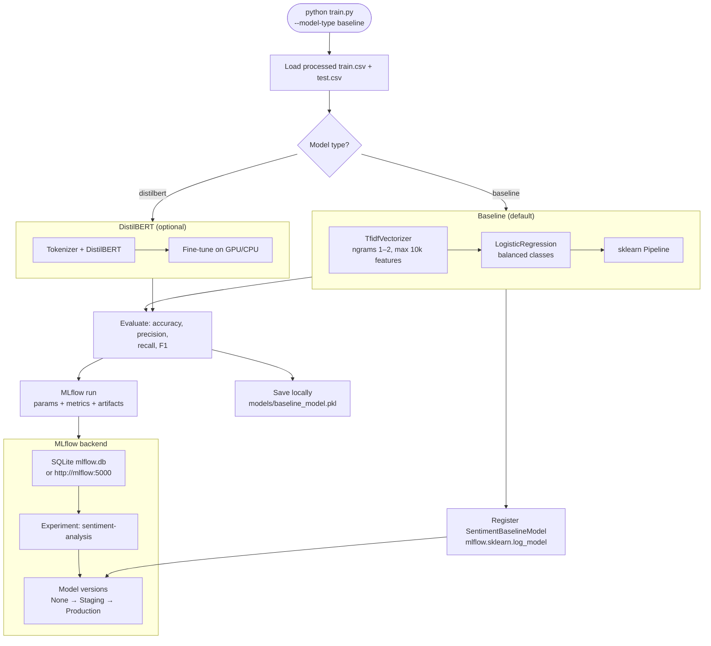
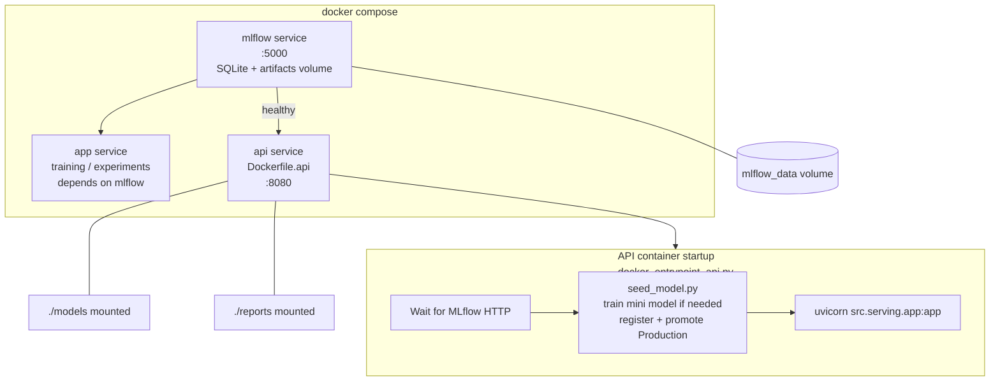
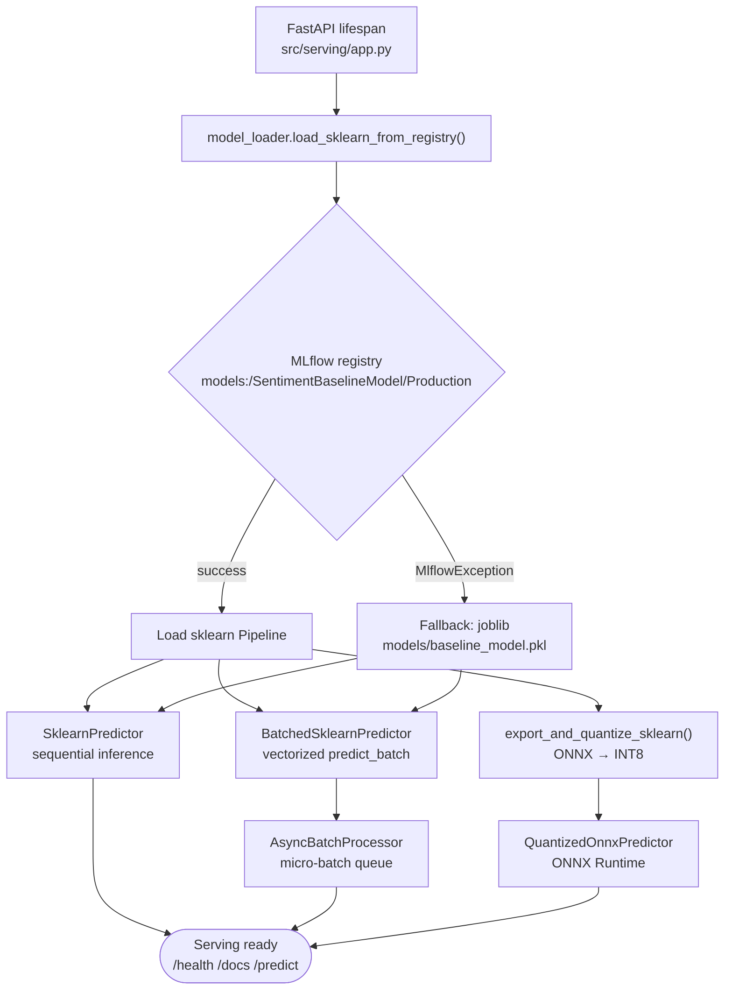
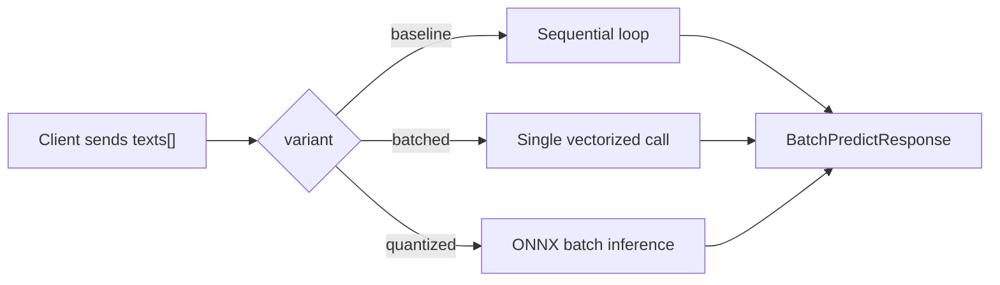
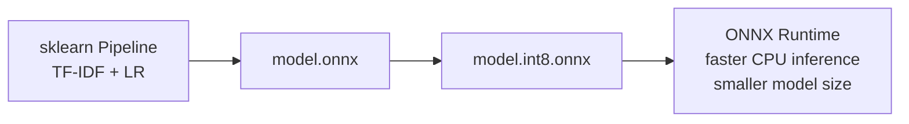
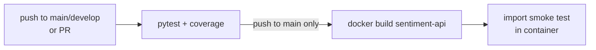

# Architecture & System Flow

This document describes how the **Sentiment Analysis MLOps** project works end-to-end: data versioning, training, model registry, serving, and deployment.

For technology background, see [TECHNOLOGIES.md](./TECHNOLOGIES.md).  
For Week 3 setup instructions, see [WEEK3_INTEGRATION.md](./WEEK3_INTEGRATION.md).

---

## 1. End-to-End Overview

The project follows three phases:

| Phase | Purpose | Key entry points |
|-------|---------|------------------|
| **Data** | Version, clean, and split IMDB reviews | `dvc repro`, `src/data/` |
| **Training** | Train models and log to MLflow | `train.py`, `scripts/promote_model.py` |
| **Serving** | Expose optimized inference via FastAPI | `src/serving/`, `Dockerfile.api` |



---

## 2. Data Pipeline

DVC defines a single reproducible stage in `dvc.yaml`. When source code or raw data changes, `dvc repro` re-runs ingestion and regenerates processed CSVs.



### Per-review processing steps

1. **Load** — Read CSV; normalize column names (`review` → `text`, `label` → `sentiment`).
2. **Clean** — PII anonymization, URL/HTML removal, whitespace normalization, optional lowercasing.
3. **Filter** — Drop rows with empty `cleaned_text` after cleaning.
4. **Split** — Stratified 80/20 train/test split (class balance preserved).
5. **Save** — Write to `data/processed/` (skipped if files already exist — idempotent).

Raw datasets are tracked with **DVC** (`.dvc` files under `data/raw/`). This keeps large files out of Git while preserving lineage between code and data.

---

## 3. Training & Experiment Tracking



### Promotion to Production

After training registers a model version, promote it for serving:

```bash
python scripts/promote_model.py --stage Production
```

The API loads `models:/SentimentBaselineModel/Production` by default.

---

## 4. Docker Deployment Topology

`docker-compose.yml` orchestrates three services:

| Service | Image | Port | Role |
|---------|-------|------|------|
| `mlflow` | `Dockerfile` | 5000 | MLflow tracking server + artifact store |
| `app` | `Dockerfile` | — | Training / experiment container |
| `api` | `Dockerfile.api` | 8080 | FastAPI inference service |



### Docker bootstrap (`seed_model.py`)

When the API container starts:

1. Check if a **Production** model exists in MLflow → if yes, skip.
2. Otherwise train a minimal baseline on synthetic sample texts.
3. Save to `models/baseline_model.pkl`.
4. Register in MLflow and promote to **Production**.

This makes the API container self-contained for demos without requiring a full `dvc repro` + `train.py` run first.

---

## 5. API Startup & Model Loading



At startup the app builds **three inference paths** from one loaded sklearn pipeline:

- **baseline** — one text at a time
- **batched** — vectorized batch calls
- **quantized** — INT8 ONNX model (exported on first start if missing)

---

## 6. Inference Request Flows

### Single prediction — `POST /predict`

Default variant is `async_batched` (concurrent micro-batching).

```mermaid
flowchart TB
    CLIENT["Client POST /predict<br/>{ text: \"...\" }"]
    Q{variant query param}

    CLIENT --> Q

    Q -->|async_batched default| ABQ["AsyncBatchProcessor queue"]
    ABQ --> WAIT["Wait up to BATCH_WAIT_MS (25ms)<br/>or BATCH_MAX_SIZE (32)"]
    WAIT --> VEC["BatchedSklearnPredictor.predict_batch()"]
    VEC --> RESP["PredictResponse<br/>sentiment, confidence, probabilities"]

    Q -->|baseline| SEQ["SklearnPredictor.predict_one()"]
    Q -->|batched| BAT["BatchedSklearnPredictor.predict_one()"]
    Q -->|quantized| ONNX["QuantizedOnnxPredictor<br/>INT8 ONNX Runtime"]

    SEQ --> RESP
    BAT --> RESP
    ONNX --> RESP
```

### Batch prediction — `POST /predict/batch`



### API endpoints

| Endpoint | Method | Description |
|----------|--------|-------------|
| `/health` | GET | Service health, loaded model, enabled optimizations |
| `/model/info` | GET | Registry URI, stage, class labels |
| `/predict` | POST | Single-text prediction (async batching by default) |
| `/predict/batch` | POST | Explicit multi-text batch |
| `/docs` | GET | Swagger UI (OpenAPI) |
| `/redoc` | GET | ReDoc API reference |

**Sentiment classes:** `positive`, `negative`, `neutral`

---

## 7. Optimization Layer (Week 3)

| Technique | Module | When used |
|-----------|--------|-----------|
| **Async micro-batching** | `src/serving/batching.py` | Default `/predict` — coalesces concurrent requests |
| **Vectorized batching** | `src/serving/predictors/batched.py` | `/predict/batch` or `variant=batched` |
| **INT8 quantization** | `src/serving/optimization/quantization.py` | sklearn → ONNX → UINT8; `variant=quantized` |



Benchmark all variants:

```bash
python scripts/run_benchmark.py --samples 200 --runs 5 --output-dir reports/week3
```

Outputs:

- `reports/week3/week3_benchmark.json` — machine-readable metrics
- `reports/week3/week3_benchmark.md` — comparison table (latency, throughput, memory, model size)

---

## 8. CI/CD Pipeline



Defined in `.github/workflows/ci.yml`:

1. **test** — install deps, run `pytest` with coverage on every push/PR.
2. **docker** — build and smoke-test the Docker image on pushes to `main` (after tests pass).

---

## 9. Typical Workflows

### Local development (full pipeline)

```bash
dvc repro
python train.py --model-type baseline
python scripts/promote_model.py --stage Production
uvicorn src.serving.app:app --host 0.0.0.0 --port 8080
python scripts/run_benchmark.py
```

### Docker (recommended for serving)

```powershell
.\scripts\docker_test_api.ps1
```

Or manually:

```bash
docker compose build mlflow api
docker compose up -d mlflow api
curl http://localhost:8080/health
```

### Request lifecycle (happy path)

```
Client → POST /predict { "text": "This movie was wonderful!" }
      → AsyncBatchProcessor queues text
      → flush as batch → BatchedSklearnPredictor
      → TF-IDF transform → LogisticRegression predict_proba
      → JSON: { sentiment, confidence, probabilities, model_variant }
```

---

## 10. Project Structure

```text
sentiment-analysis-mlops/
├── data/
│   ├── raw/              # DVC-tracked source CSVs
│   └── processed/        # DVC pipeline output (train/test)
├── src/
│   ├── data/
│   │   ├── ingest.py     # Prefect-orchestrated ingestion flow
│   │   └── processor.py  # Loaders, cleaners, splits
│   ├── models/
│   │   ├── baseline.py   # TF-IDF + Logistic Regression
│   │   └── distilbert.py # Optional transformer model
│   └── serving/
│       ├── app.py        # FastAPI application
│       ├── model_loader.py
│       ├── batching.py
│       ├── benchmarking.py
│       ├── optimization/ # ONNX INT8 quantization
│       └── predictors/   # baseline, batched, quantized
├── scripts/
│   ├── seed_model.py     # Docker bootstrap
│   ├── promote_model.py  # Registry stage promotion
│   ├── run_benchmark.py  # Week 3 benchmarks
│   └── docker_entrypoint_api.py
├── models/               # Local .pkl + quantized ONNX artifacts
├── reports/week3/        # Benchmark reports
├── dvc.yaml              # Data pipeline definition
├── train.py              # Training + MLflow logging
├── docker-compose.yml    # mlflow + app + api services
├── Dockerfile            # MLflow / training image
└── Dockerfile.api        # Production inference image
```

---

## 11. Environment Variables (Serving)

| Variable | Default | Purpose |
|----------|---------|---------|
| `MLFLOW_TRACKING_URI` | `sqlite:///mlflow.db` | MLflow tracking backend |
| `MLFLOW_MODEL_NAME` | `SentimentBaselineModel` | Registry model name |
| `MLFLOW_MODEL_STAGE` | `Production` | Stage to load |
| `FALLBACK_MODEL_PATH` | `models/baseline_model.pkl` | Local fallback if registry unavailable |
| `BATCH_MAX_SIZE` | `32` | Max async micro-batch size |
| `BATCH_WAIT_MS` | `25` | Max wait before flushing partial batch |
| `QUANTIZED_MODEL_DIR` | `models/quantized` | ONNX artifact directory |
