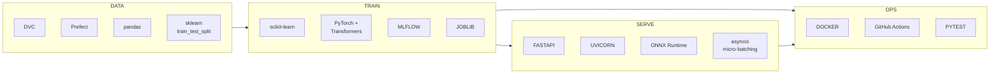

# Technologies Used in This Project

This document introduces the tools, libraries, and frameworks that power the Sentiment Analysis MLOps pipeline. Each section explains **what** the technology is, **why** it is used here, and **where** it appears in the codebase.

For system diagrams and request flows, see [ARCHITECTURE.md](./ARCHITECTURE.md).

---

## Quick Reference

| Category | Technologies |
|----------|-------------|
| **Language** | Python 3.10+ (3.12 in Docker images) |
| **Data versioning** | DVC (Data Version Control) |
| **Orchestration** | Prefect |
| **ML framework** | scikit-learn, PyTorch + Hugging Face Transformers (optional) |
| **Experiment tracking** | MLflow |
| **API / serving** | FastAPI, Uvicorn, Pydantic |
| **Optimization** | ONNX, ONNX Runtime, skl2onnx |
| **Containers** | Docker, Docker Compose |
| **CI** | GitHub Actions, pytest |

---

## Core Language & Runtime

### Python

The entire project is written in **Python**. It is the de facto language for ML workflows thanks to rich ecosystem support for data science, model training, and serving.

- **Training & data:** `train.py`, `src/data/`, `src/models/`
- **Serving:** `src/serving/`
- **Scripts:** `scripts/`

Docker images use **Python 3.12-slim** (`Dockerfile`, `Dockerfile.api`) for a small, reproducible runtime.

---

## Data Management

### DVC (Data Version Control)

**What:** DVC is a Git-compatible system for versioning datasets and ML pipelines. It stores large files outside Git (local cache or remote storage) while tracking metadata in `.dvc` files and `dvc.lock`.

**Why here:** IMDB review datasets are too large for Git. DVC ensures every training run can be tied to an exact data snapshot. The pipeline stage in `dvc.yaml` automatically re-runs when code or raw data changes.

**Where:**
- `dvc.yaml` — pipeline definition (`ingest_and_process` stage)
- `dvc.lock` — locked stage inputs/outputs
- `data/raw/*.dvc` — pointers to versioned raw CSVs
- Command: `dvc repro`

### pandas & NumPy

**What:** `pandas` provides DataFrame-based tabular data handling; `NumPy` underpins numerical operations.

**Why here:** Load CSVs, apply text cleaning row-wise, stratified splits, and feed feature matrices to scikit-learn.

**Where:** `src/data/processor.py`, `train.py`, `scripts/run_benchmark.py`

### Hugging Face `datasets` (optional)

**What:** Library for downloading and streaming public ML datasets.

**Why here:** `scripts/prepare_data.py` can download a balanced IMDB sample when raw CSVs are missing.

**Where:** `scripts/prepare_data.py`, `requirements-docker.txt`

---

## Data Pipeline Orchestration

### Prefect

**What:** Prefect is a workflow orchestration framework. It decorates functions as `@task` and `@flow`, giving structured, observable pipelines with logging and retry support.

**Why here:** The ingestion step (`src/data/ingest.py`) uses a Prefect flow to coordinate loading, cleaning, splitting, and saving — making the ETL DAG explicit and easy to extend.

**Where:**
- `src/data/ingest.py` — `compliance_pipeline` flow with three tasks
- `requirements-docker.txt`

### SOLID-style data processing

The `src/data/processor.py` module applies design patterns (not a third-party tool, but a key architectural choice):

- **DataLoaderInterface** / **IMDBReviewLoader** — swappable data sources
- **TextCleanerInterface** / **BasicTextCleaner** — PII masking, HTML/URL stripping
- **DataProcessor** — coordinates loader + cleaner + train/test split

---

## Machine Learning

### scikit-learn

**What:** Industry-standard library for classical ML: vectorization, classification, pipelines, and metrics.

**Why here:** The default **baseline model** is a sklearn `Pipeline`:

1. `TfidfVectorizer` — converts text to TF-IDF features (unigrams + bigrams)
2. `LogisticRegression` — multiclass classifier (`positive`, `negative`, `neutral`)

**Where:**
- `src/models/baseline.py`
- `train.py` — training and evaluation
- `src/serving/predictors/` — inference wrappers

### PyTorch & Hugging Face Transformers (optional)

**What:** PyTorch is a deep learning framework. Hugging Face `transformers` provides pre-trained models like **DistilBERT**.

**Why here:** An optional, higher-capacity model path for comparison with the sklearn baseline. DistilBERT is a lighter BERT variant suitable for sentiment fine-tuning.

**Where:**
- `src/models/distilbert.py`
- `src/serving/optimization/quantization.py` — `quantize_pytorch_model()` for INT8 PyTorch weights
- Activated via: `python train.py --model-type distilbert`

> PyTorch/Transformers are commented out in `requirements-api.txt` by default to keep the serving image lean.

### joblib

**What:** Efficient serialization for Python objects, especially sklearn models.

**Why here:** Saves/loads `models/baseline_model.pkl` as a local fallback when MLflow registry is unavailable.

**Where:** `src/models/baseline.py`, `src/serving/model_loader.py`

---

## Experiment Tracking & Model Registry

### MLflow

**What:** MLflow is an open-source platform for the full ML lifecycle: experiment tracking, model packaging, and a **Model Registry** with versioned stages (None → Staging → Production).

**Why here:**
- Every `train.py` run logs parameters, metrics, and artifacts
- Baseline models are registered as `SentimentBaselineModel`
- The API loads `models:/SentimentBaselineModel/Production`
- SQLite backend locally; HTTP server in Docker (`mlflow` service on port 5000)

**Where:**
- `train.py` — `mlflow.start_run()`, `mlflow.sklearn.log_model()`
- `src/serving/model_loader.py` — registry loading + fallback
- `scripts/promote_model.py` — stage transitions
- `scripts/seed_model.py` — Docker bootstrap registration
- `docker-compose.yml` — `mlflow` service

### SQLite (MLflow backend store)

**What:** Embedded relational database with ACID guarantees.

**Why here:** Replaces MLflow's default file-based store to avoid file-locking issues during concurrent runs. In Docker, MLflow uses `sqlite:////mlflow/mlflow.db` inside a named volume.

**Where:** `README.md` (design rationale), `docker-compose.yml`

---

## Model Serving & API Layer

### FastAPI

**What:** Modern, high-performance Python web framework for building APIs. Auto-generates OpenAPI (Swagger) documentation.

**Why here:** Exposes REST endpoints for health checks, model info, and predictions with typed request/response models.

**Where:** `src/serving/app.py`  
**Docs:** http://localhost:8080/docs

### Uvicorn

**What:** ASGI server that runs FastAPI applications. Supports async request handling.

**Why here:** Production entrypoint in Docker and local dev:

```bash
uvicorn src.serving.app:app --host 0.0.0.0 --port 8080
```

**Where:** `scripts/docker_entrypoint_api.py`, `Dockerfile.api`

### Pydantic

**What:** Data validation library using Python type hints. Powers FastAPI request/response schemas.

**Why here:** Defines `PredictRequest`, `PredictResponse`, `HealthResponse`, etc. with automatic JSON serialization and validation.

**Where:** `src/serving/schemas.py`

---

## Inference Optimization (Week 3)

### Async micro-batching (`asyncio`)

**What:** Python's built-in async runtime. The `AsyncBatchProcessor` queues concurrent single-text requests and flushes them as one vectorized batch.

**Why here:** Improves throughput under concurrent load without requiring clients to send batch payloads. Configurable via `BATCH_MAX_SIZE` (32) and `BATCH_WAIT_MS` (25).

**Where:** `src/serving/batching.py`

### Vectorized batch inference

**What:** Instead of calling `predict()` in a loop, pass all texts at once to `predict_batch()` / `predict_proba()` — sklearn operates on a matrix in one call.

**Why here:** Reduces Python overhead and leverages optimized linear algebra backends (BLAS).

**Where:** `src/serving/predictors/batched.py`

### ONNX & skl2onnx

**What:**
- **ONNX** (Open Neural Network Exchange) — portable model format
- **skl2onnx** — converts fitted sklearn pipelines to ONNX graphs

**Why here:** Export the baseline TF-IDF + Logistic Regression pipeline to `model.onnx` for cross-runtime deployment.

**Where:** `src/serving/optimization/quantization.py`

### ONNX Runtime + INT8 quantization

**What:** ONNX Runtime is a high-performance inference engine. **Dynamic quantization** converts FP32 weights to 8-bit integers, reducing model size and often improving CPU latency.

**Why here:** Serves the `quantized` inference variant via `QuantizedOnnxPredictor`.

**Where:**
- `src/serving/optimization/quantization.py` — `export_and_quantize_sklearn()`
- `src/serving/predictors/quantized.py`
- Artifacts: `models/quantized/model.int8.onnx`

### psutil

**What:** Cross-platform library for system and process utilities (memory, CPU).

**Why here:** Benchmarking peak memory usage during inference (`src/serving/benchmarking.py`).

**Where:** `scripts/run_benchmark.py`, `src/serving/benchmarking.py`

---

## Containers & Deployment

### Docker

**What:** Containerization platform that packages code, dependencies, and runtime into portable images.

**Why here:** Reproducible environments for MLflow, training, and the API without "works on my machine" issues.

**Where:**
- `Dockerfile` — MLflow / training image (`requirements-docker.txt`)
- `Dockerfile.api` — multi-stage optimized inference image (`requirements-api.txt`)

### Docker Compose

**What:** Tool for defining and running multi-container applications with a single `docker-compose.yml`.

**Why here:** Orchestrates three services:

| Service | Role |
|---------|------|
| `mlflow` | Tracking server + artifact store |
| `app` | Training / experiment runner |
| `api` | FastAPI inference (waits for MLflow, seeds model, serves) |

**Where:** `docker-compose.yml`

### Multi-stage Docker build (`Dockerfile.api`)

**What:** Separate **builder** stage (install compile deps) and **runtime** stage (slim final image).

**Why here:** Smaller production image — build tools are not shipped to runtime. Runs as non-root `appuser` for security.

**Where:** `Dockerfile.api`

---

## Testing & CI/CD

### pytest

**What:** Python testing framework. Supports fixtures, parametrization, and plugins like coverage.

**Why here:** Unit and integration tests under `tests/` run on every push and pull request.

**Where:** `.github/workflows/ci.yml`

### GitHub Actions

**What:** CI/CD platform integrated with GitHub repositories.

**Why here:** Automated pipeline:
1. **test** job — install dependencies, run pytest with coverage
2. **docker** job — build and smoke-test Docker image on `main` pushes

**Where:** `.github/workflows/ci.yml`

---

## Configuration & Utilities

### Environment variables

Serving behavior is driven by environment variables (12-factor app pattern) rather than hard-coded paths:

| Variable | Purpose |
|----------|---------|
| `MLFLOW_TRACKING_URI` | Where to find experiments and registry |
| `MLFLOW_MODEL_NAME` | Registered model name |
| `MLFLOW_MODEL_STAGE` | Stage to load (e.g. Production) |
| `FALLBACK_MODEL_PATH` | Local pickle fallback |
| `BATCH_MAX_SIZE` / `BATCH_WAIT_MS` | Micro-batching tuning |
| `QUANTIZED_MODEL_DIR` | ONNX artifact location |

**Where:** `src/serving/config.py`, `docker-compose.yml`, `Dockerfile.api`

### `config.py`

**What:** Central application settings for training (processed data path, hyperparameters, random seed).

**Where:** Root `config.py`, imported by `train.py`

---

## Technology Stack by Project Phase



---

## Dependency Files

| File | Scope |
|------|-------|
| `requirements-docker.txt` | MLflow, Prefect, sklearn, datasets — training/MLflow image |
| `requirements-api.txt` | FastAPI, ONNX, MLflow — lean inference image |

Install locally for serving:

```bash
pip install -r requirements-api.txt
```

---

## Further Reading

| Topic | Document |
|-------|----------|
| System flow & diagrams | [ARCHITECTURE.md](./ARCHITECTURE.md) |
| Week 3 setup & API usage | [WEEK3_INTEGRATION.md](./WEEK3_INTEGRATION.md) |
| Getting started | [README.md](../README.md) |

### Official documentation links

- [DVC](https://dvc.org/doc)
- [MLflow](https://mlflow.org/docs/latest/index.html)
- [FastAPI](https://fastapi.tiangolo.com/)
- [scikit-learn](https://scikit-learn.org/stable/)
- [ONNX Runtime](https://onnxruntime.ai/docs/)
- [Prefect](https://docs.prefect.io/)
- [Docker](https://docs.docker.com/)
